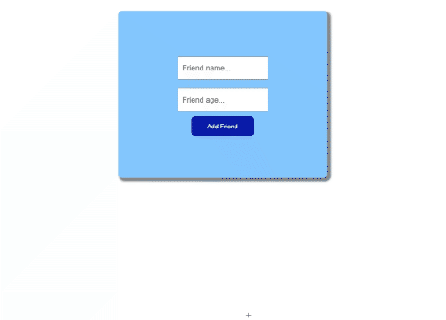

# MERN Stack App

#### An example for a CRUD app which you can manage a friends list.

#### By Egemen Kar

## Preview

## Technologies Used

Front-End (Client)

* React
* Axios

Back-End (Server)

* Node JS
* Express
* MongoDB (mongoose)
* Cors

## Description

I just created a simple CRUD app with the MERN stack. You can manage a friends list with the app. You can add, store, read, delete and update friends list in the MongoDB.

## Setup/Installation Requirements

* Clone this repository to your desktop.
* You need to have NodeJs and MongoDb on your computer.
* You can check [here](https://zellwk.com/blog/local-mongodb/) to learn about how to setup a local MongoDb database.
* Npm install dependencies for client and server.
* "Node index.js" to start the server and "npm start" to start the client side React app.

## License

Licensed under the [MIT License](LICENSE)

Copyright (c) 2021 Egemen Kar